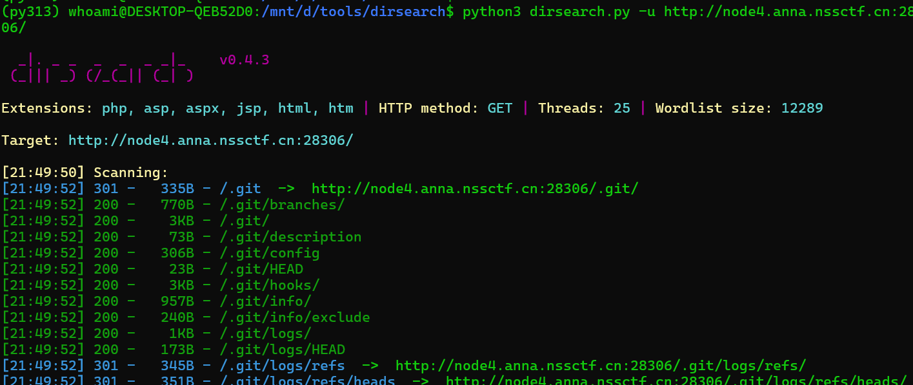
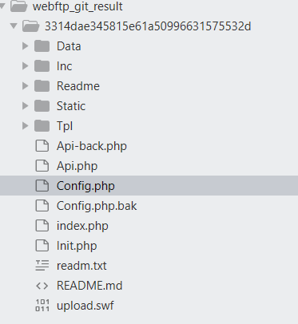
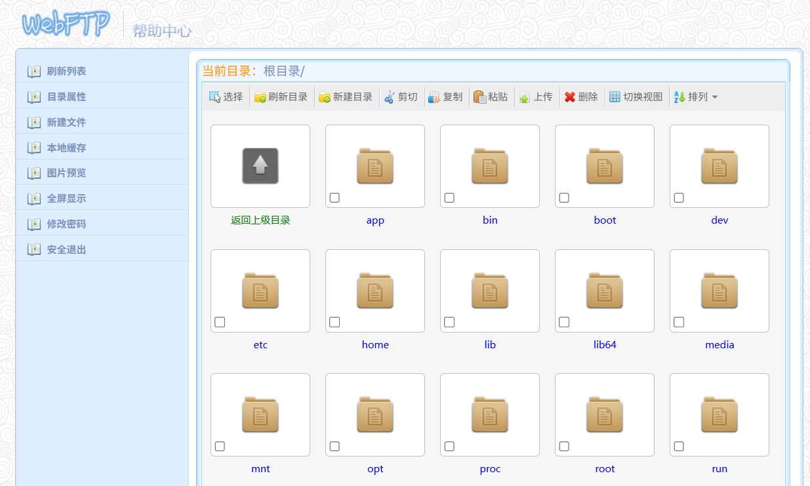
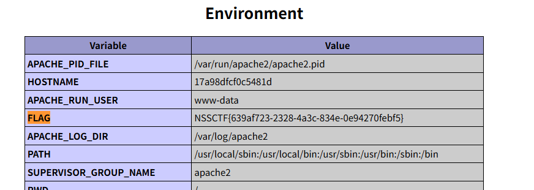

# WebFTP

题目链接：https://www.nssctf.cn/problem/344


解题思路：

使用dirsearch一顿扫描，即可以发现存在.git目录的泄露：



然后执行如下命令得到源码：

```
githacker --url http://node4.anna.nssctf.cn:28306/.git --output-folder ./webftp_git_result/
```



阅读README.md文件，得到WebFTP系统的登录用户名/密码：

```
使用说明
1、初始账号
	超级管理员 admin 密码 admin888
```

登录WebFTP：



在app目录下，有phpinfo.php文件。直接访问：

http://node4.anna.nssctf.cn:28306/phpinfo.php

即可以看到flag:


